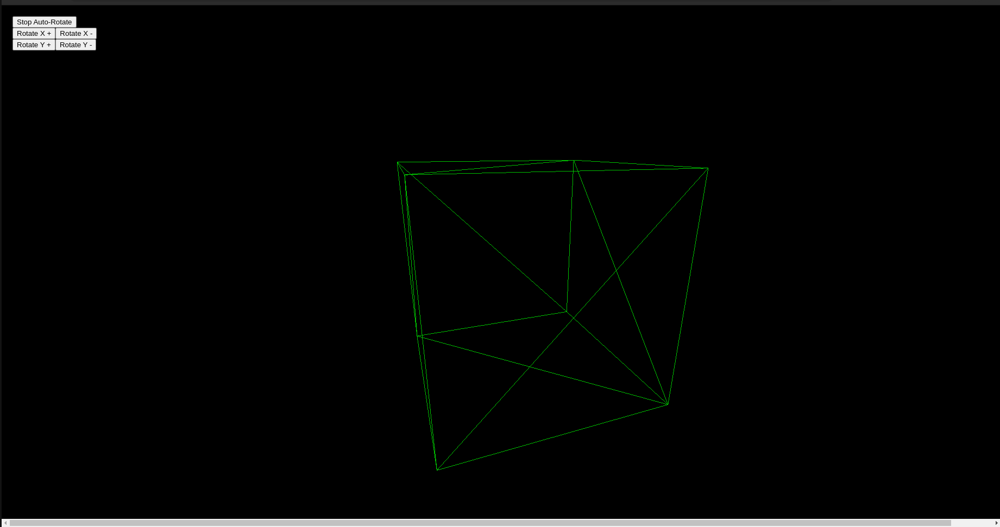

# Rotating Cube 3D Project

Ce projet est une application React qui affiche un cube géant 3D transparent utilisant `three.js`. Le cube peut tourner automatiquement ou manuellement grâce à des boutons.

## Fonctionnalités

- Affichage d'un cube 3D géant, transparent et en fil de fer.
- Contrôle manuel de la rotation sur les axes X et Y via des boutons.
- Option pour activer/désactiver la rotation automatique.

---

## Installation et exécution

### Prérequis

- Node.js installé sur votre machine.

### Étapes

1. Clonez le projet :

   ```bash
   git clone https://github.com/mon-utilisateur/rotating-cube.git
   cd rotating-cube
   ```

## Capture D'écran du Site

Voici un aperçu du cube 3D géant en action :

